# ARARE

Adaptive Real-Time Analysis and Re-evaluation Engine for university timetable scheduling.

ARARE is a full-stack scheduling system built around a Spring Boot backend, a Timefold optimization engine, and a React/Vite frontend. The backend owns the domain model, persistence, solver lifecycle, disruption analysis, and import/export pipelines. The frontend provides the operator workflow for managing academic data, launching scheduling runs, inspecting solved timetables, and reacting to disruptions.

This document is written from the source code and is intended to function as the project's technical guide. Where the source does not define behavior, this documentation does not speculate.

## 1. Introduction

The repository solves a university timetable problem under hard, medium, and soft constraints. The system is designed around a simple operating model:

1. Maintain master data such as departments, batches, teachers, rooms, subjects, and timeslots.
2. Configure the institution-wide scheduling rules.
3. Generate a schedule with Timefold.
4. Inspect the score, conflicts, and timetable layout.
5. Apply disruptions or events and re-optimize only the impacted sessions.
6. Export the result to CSV or calendar feeds.

The codebase is split into two cooperating applications:

- `src/main/java` contains the Spring Boot backend.
- `frontend/src` contains the React single-page application.

## 2. System Overview

### What the system is for

The repository models the workflow of an academic scheduling office. It is not just a CRUD system with a solver attached. The master data, the planning model, the solver lifecycle, disruption handling, and export flows are all part of one scheduling engine.

### How the pieces cooperate

1. The frontend collects the operator's intent and calls a REST endpoint.
2. The controller validates the request and delegates to a domain service.
3. The service performs feasibility checks or orchestration work.
4. The solver package builds a Timefold planning problem from persistent data.
5. Timefold searches for a valid and high-quality assignment.
6. The winning solution is persisted back to managed entities.
7. The frontend renders the result or uses it as input to a follow-up workflow such as partial resolve or export.

### Runtime responsibilities

- Backend: source of truth for data, constraints, and schedule generation.
- Frontend: operator workflow, inspection UI, and navigation.
- Database: persistent master data and schedule history.

## 3. Architecture

### Layered backend design

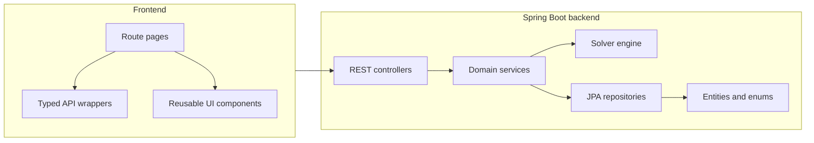

### Architectural principles

- Controllers stay thin and only translate HTTP to application calls.
- Services own orchestration and business rules.
- Repositories isolate persistence concerns.
- Entities model the business domain and database constraints.
- The solver layer is deliberately separate from ordinary CRUD services because it needs a planning model rather than a transactional entity graph.

### Key runtime subsystems

- Master data management for departments, rooms, teachers, subjects, batches, sections, timeslots, academic terms, and university configuration.
- Scheduling engine for timetable generation and export.
- Solver engine for constraint-driven optimization.
- Impact engine for disruption analysis and incremental repair.
- Import engine for bulk CSV ingestion.

## 4. Technology Stack

### Backend

- Java 21
- Spring Boot 3.3.0
- Spring Web
- Spring Data JPA
- Spring Validation
- Flyway
- PostgreSQL runtime database
- H2 for tests
- Timefold Solver 1.14.0
- MapStruct present in the build, though no generated mapper classes appear in the current source tree
- Lombok

### Frontend

- React 18
- TypeScript
- Vite
- React Router
- Axios
- TanStack Query listed in package metadata, but the current source uses direct API wrappers rather than query hooks
- react-hot-toast dependency is present, but the app uses a custom toast context
- Recharts for analytics charts
- Lucide icons
- Tailwind CSS

## 5. Repository Layout

### Backend modules

- `com.arare.common` contains shared persistence support.
- `com.arare.common.enums` defines the scheduling vocabulary.
- `com.arare.config` holds infrastructure configuration.
- `com.arare.exception` centralizes error mapping.
- `com.arare.utils` contains shared constants.
- `com.arare.features.*` contains the business modules.

### Frontend modules

- `src/App.tsx` defines the route tree.
- `src/services` contains the HTTP client and typed endpoint wrappers.
- `src/pages` contains the route-level screens.
- `src/components/layout` contains the shell and navigation.
- `src/components/timetable` contains timetable visualization.
- `src/components/solver` contains the solver progress UI.
- `src/components/ui` contains the reusable design system.

## 6. Build and Run

### Backend

The backend is a Maven project rooted at `pom.xml`.

- `mvn test`
- `mvn spring-boot:run`

### Frontend

The frontend is located in `frontend/`.

- `npm install`
- `npm run dev`
- `npm run build`

### Runtime database

The backend expects PostgreSQL by default.

Environment variables:

- `ARARE_DB_URL`
- `ARARE_DB_USERNAME`
- `ARARE_DB_PASSWORD`

Defaults in `application.properties` point to `jdbc:postgresql://localhost:5432/araredb` with user `postgres` and password `123456`.

## 7. Configuration and Persistence

### Backend configuration

File: `src/main/resources/application.properties`

- `spring.jpa.hibernate.ddl-auto=validate`
- `spring.jpa.open-in-view=false`
- `spring.flyway.enabled=true`
- `spring.flyway.locations=classpath:db/migration`
- `spring.flyway.baseline-on-migrate=true`
- `timefold.solver.termination.spent-limit=30s`

Interpretation:

- Hibernate validates the schema rather than mutating it.
- Flyway owns schema evolution.
- The solver has a default 30 second time limit unless overridden per request.

### Database migration

File: `src/main/resources/db/migration/V1__entity_hardening_and_slot_ordering.sql`

This migration hardens existing tables and adds derived constraints:

- Adds `version` columns to BaseEntity-backed tables.
- Backfills `created_at` and `updated_at` on existing rows.
- Forces those audit columns to be non-null.
- Adds `slot_number` to `timeslots`.
- Adds unique indexes for building names, class section labels per batch, pre-allocation uniqueness, and day/slot-number uniqueness for timeslots.

The script is defensive and guards against missing tables, which makes it usable against fresh and existing databases.

### Frontend build configuration

File: `frontend/vite.config.ts`

- Vite dev server runs on port 5173.
- `/api` requests proxy to `VITE_BACKEND_URL` or `http://localhost:8080`.

File: `frontend/tailwind.config.js`

- Tailwind scans `index.html` and `src/**/*.{js,ts,jsx,tsx}`.
- It extends the `primary` color scale and a `slide-in` animation.

File: `frontend/postcss.config.js`

- Tailwind and Autoprefixer are enabled.

File: `frontend/tsconfig.json`

- Strict TypeScript mode is enabled.
- `noUnusedLocals`, `noUnusedParameters`, and `noFallthroughCasesInSwitch` are on.

### JPA model foundation

`BaseEntity` provides identity, auditing, and optimistic locking for most tables. JPA auditing is enabled globally, and the Flyway migration hardens the schema so audit columns, versioning, and critical uniqueness rules are enforced at the database level.

## 8. Domain Model

### `BaseEntity`

File: `src/main/java/com/arare/common/BaseEntity.java`

All major entities extend this mapped superclass.

- `id` is a generated identity primary key.
- `createdAt` is populated by JPA auditing.
- `updatedAt` is populated by JPA auditing.
- `version` supports optimistic locking.

The class uses `@EqualsAndHashCode(of = "id")` so entity identity comparisons work with Timefold joiners and Hibernate proxies.

### JPA auditing

File: `src/main/java/com/arare/config/JpaConfig.java`

- Enables `@CreatedDate` and `@LastModifiedDate` population on `BaseEntity`.

### Constants

File: `src/main/java/com/arare/utils/Constants.java`

- `DISRUPTION_PENALTY_ROOM_CHANGE = 2`
- `DISRUPTION_PENALTY_TEACHER_CHANGE = 5`
- `DISRUPTION_PENALTY_TIMESLOT_CHANGE = 10`
- `DEFAULT_MAX_SAME_SUBJECT_PER_DAY = 1`
- `API_V1 = "/api/v1"`

The constants are used as shared defaults and operator guidance. There is no separate runtime configuration layer for constraint weights in the backend source.

The domain model is intentionally shaped around scheduling rather than generic CRUD. The most important relationships are:

- departments own batches and subjects
- batches may be subdivided into class sections
- teachers teach subjects and have availability/preferences
- rooms belong to buildings and may be filtered by availability and type
- timeslots define the weekly topology that the solver can place sessions into
- schedules group solved sessions for one run or one derivative run
- pre-allocations and events modify the solver's search space

### Core scheduling entities


## 9. Database Model

The database schema reflects the business boundaries of the scheduler rather than a generic academic ERP.

### Core relationships

- A department owns many batches and subjects.
- A batch can be split into class sections.
- A subject belongs to one department and may require a teacher and/or room.
- A teacher can teach many subjects and has availability and preference data.
- A room belongs to one building and can be constrained by type and availability.
- A schedule groups solved class sessions and may derive from a parent schedule.
- A pre-allocation pins a planned assignment inside a schedule.
- An event describes a disruption or special day that can trigger partial repair.

### Schema guarantees

- Audit columns are enforced by JPA auditing and the migration script.
- Version columns support optimistic locking.
- Unique constraints prevent duplicate business identities such as department code, batch section, timeslot day/slot number, and pre-allocation collisions.

### Why these relationships exist

They exist because the solver needs meaningful constraints, not just rows. The domain model is structured so the scheduler can answer questions such as:

- Which rooms can this subject use?
- Which teachers can teach this subject?
- Which batches are impacted by this disruption?
- Which sessions must stay fixed when deriving a new schedule?

## 10. Scheduling Workflow

The schedule lifecycle is the backbone of the system. It starts with feasibility analysis, proceeds through problem construction, and ends with persistence of a solved timetable.

### Schedule generation

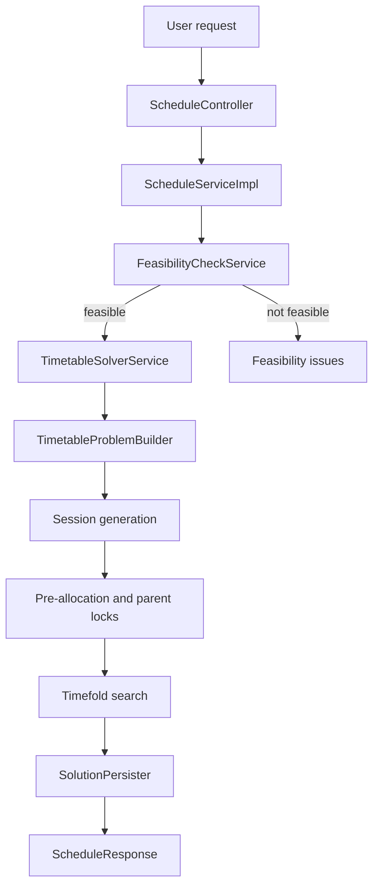

### Lifecycle stages

1. The controller accepts the request and resolves the target schedule scope.
2. The schedule service performs a feasibility check before any solver work begins.
3. The solver service builds a planning problem from the current database state.
4. Required sessions are generated from subject demand and batch structure.
5. Pre-allocations and parent locks are applied before solving.
6. Timefold evaluates constraints and searches for a feasible assignment.
7. The best solution is persisted into the schedule and its sessions.
8. The frontend refreshes the timetable view and score panels.

### Partial resolve

Partial resolve is used when only some sessions are affected, typically after a disruption or event.

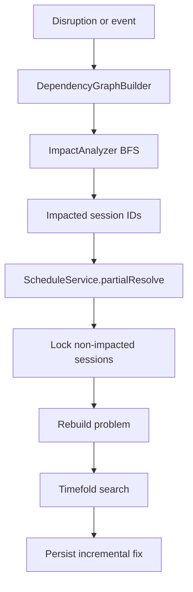

### Event application

Events follow the same pipeline as disruptions, but the trigger comes from a stored event record. The service expands the event across its date range, computes direct impacts, merges the affected session set, and hands the result back to the partial resolver.

### CSV import

CSV import is a separate bulk-data pipeline that populates master data. It does not participate in solving directly, but it prepares the entities the solver depends on.

## 11. Solver Engine

This is the central subsystem of the project.

### What problem it solves

The solver assigns teachers, rooms, and timeslots to a generated set of class sessions while respecting hard constraints and optimizing the schedule according to medium and soft preferences.

### Planning model

- Planning solution: `TimetableSolution`
- Planning entity: `ClassSession`
- Planning variables: teacher, room, timeslot
- Problem facts: timeslots, rooms, teachers, subjects, batches, class sections, buildings, configuration, and supporting schedule data
- Score type: `HardMediumSoftScore`

### Solver pipeline

```mermaid
flowchart LR
  A[Problem data] --> B[Problem builder]
  B --> C[Session generator]
  C --> D[Topology validation]
  D --> E[Pre-allocation application]
  E --> F[Parent schedule locking]
  F --> G[Lazy association initialization]
  G --> H[Timefold solver]
  H --> I[Constraint provider]
  I --> J[Best solution]
  J --> K[Solution persister]
```

### Problem building

The problem builder is responsible for converting persisted data into a solver-ready object graph. This is where the scheduling engine becomes deterministic: the builder defines the exact fact set and entity set that Timefold will search over.

It performs the following work:

1. Loads the active configuration and selected domain data.
2. Validates the timeslot topology so the solver is not launched against an impossible calendar structure.
3. Reuses existing sessions or generates fresh sessions when needed.
4. Applies parent locks for derivative schedules.
5. Applies explicit pre-allocations.
6. Locks sessions outside the impacted set during partial repair.
7. Initializes lazy associations so constraint evaluation can traverse the graph safely.

### Session generation

Session generation expands demand into concrete `ClassSession` rows. The algorithm is intentionally simple and business-driven:

1. Sort subjects so larger chunk sizes are considered first.
2. For each batch, generate sessions for its department subjects.
3. Derive the number of sessions from `weeklyHours / chunkHours`.
4. For lab subjects, try whole-batch placement first.
5. If whole-batch placement fails, try class-section splitting.
6. Fall back to whole-batch generation when section-level splitting is not viable.

This approach favors feasibility over clever packing. The business rationale is that lab sessions have stronger structural requirements than lectures, so the generator preserves realistic options before the solver begins.

### Parent schedule locking

When a new schedule is derived from an existing schedule, matching sessions can be locked to preserve continuity. The matching logic uses subject, batch or section identity, and duration. This is not a generic copy operation; it is a deliberate inheritance mechanism for timetable evolution.

### Pre-allocation

Pre-allocations are fixed assignments that the solver should respect. They are applied before solving and then pinned so the search cannot move them. This allows administrators to seed important classes, manual overrides, or special fixed placements.

### Constraint provider

The constraint provider expresses the scheduling rules in three layers:

- Hard constraints reject invalid timetables.
- Medium constraints model quality problems that should be minimized.
- Soft constraints represent preferred but nonessential behavior.

#### Hard constraints

The hard layer protects timetable validity. Typical examples include teacher collisions, room collisions, batch collisions, room capacity issues, unavailable timeslots, room type mismatches, and missing required resources. A timetable with a hard violation is not acceptable regardless of its soft score.

Example: two sessions for the same teacher at the same time violate the teacher conflict rule and immediately make the solution invalid.

#### Medium constraints

The medium layer captures quality and operational smoothness. These constraints address daily workload, weekly workload, consecutive class pressure, idle gaps, subject spread, building movement, and lab alignment. They are business-important, but a timetable may still be accepted if no hard violations exist.

Example: a teacher scheduled for an excessive number of consecutive classes is still technically schedulable, but the result is worse than a balanced alternative.

#### Soft constraints

The soft layer expresses preferences. These include free-day preferences, building preferences, room stability, and subject spread preferences that improve usability without defining correctness.

Example: if two schedules are equally valid, the one that respects more free-day preferences should win.

### Score calculation

Timefold returns a `HardMediumSoftScore`, and the schedule stores both the numeric score and a textual explanation. The score explanation is used by the frontend to show the rationale behind the result rather than only the final number.

### Solution persistence

After solving, the persister copies the chosen teacher, room, timeslot, and lock state back into the managed `ClassSession` rows and updates the schedule status and score fields.

Important behavior:

- Infeasible solutions are not persisted as successful schedules.
- The schedule status reflects feasibility.
- The score explanation is preserved for later inspection.

Potential issue supported by the source:

- The persistence error path can dereference a null score while formatting an error message. That is a real null-safety risk in the current code.

### Execution example

Consider a schedule for a department with lectures and a lab:

1. The builder generates the required lecture and lab sessions.
2. A pre-allocation pins one lab in a specific room.
3. A parent schedule locks previously approved lecture placements.
4. Timefold searches remaining assignments.
5. The constraint provider penalizes room collisions, unavailable teachers, and poor distribution.
6. The best feasible solution is persisted and exposed to the frontend.

## 12. Schedule Engine

The schedule engine is responsible for feasibility checking, schedule lifecycle orchestration, exports, and user-facing conflict guidance.

### Feasibility checking

Before Timefold is started, the service validates whether the requested scope can plausibly be scheduled. This saves solver time and produces actionable feedback earlier in the workflow.

It checks for:

- missing or insufficient timeslots
- invalid subject chunking
- absent qualified teachers
- room type mismatches
- impossible batch demand versus capacity
- invalid university configuration versus timeslot topology

### Conflict suggestions

When a session has conflicts, the service computes alternate timeslots and ranks them by hard conflicts and soft penalties. This is a tactical helper for manual intervention rather than a full solver.

### Export support

The schedule engine supports CSV export and ICS calendar export. These exports are downstream consumers of a solved schedule and are meant for distribution to users and departments.

## 13. Impact Analysis Engine

The impact engine determines how disruptions propagate through a solved schedule.

### Core idea

When one session changes, the blast radius is not limited to that single row. Teacher, room, and batch collisions can chain into other sessions. The impact engine builds a dependency graph so the system can identify the affected region and re-optimize only that region.

### Dependency graph

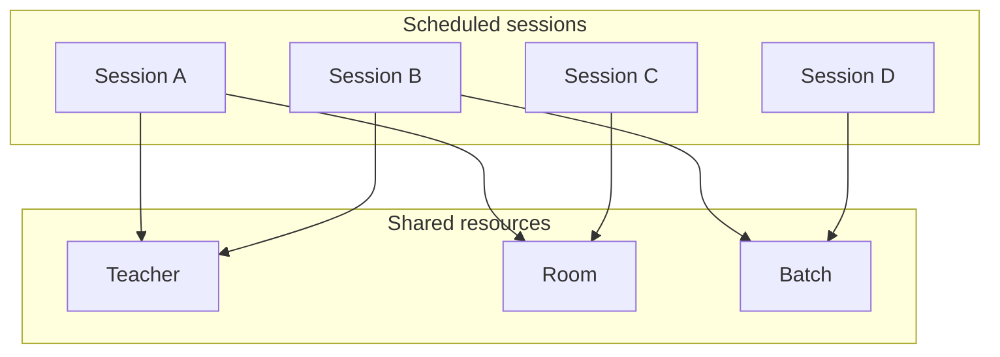

### BFS traversal

The analyzer starts from sessions directly affected by the disruption and traverses shared-resource edges with breadth-first search. This is a good fit because the goal is reachability, not shortest path.

Important behavior:

- locked sessions are included in the impacted set but are not expanded further
- timeslot-block disruptions seed unassigned sessions as well so they do not re-enter the blocked region later
- special events can affect all sessions on a date, depending on the event payload

### Partial rescheduling

Once the affected set is identified, the schedule service locks the unaffected sessions and re-runs the solver on the smaller problem. This keeps the repair process local and reduces unnecessary churn in the timetable.

## 14. Data Import Engine

### Purpose

The CSV import engine is the bulk entry point for master data. It exists so users can load or refresh core entities without having to create every row through the UI.

### Import pipeline

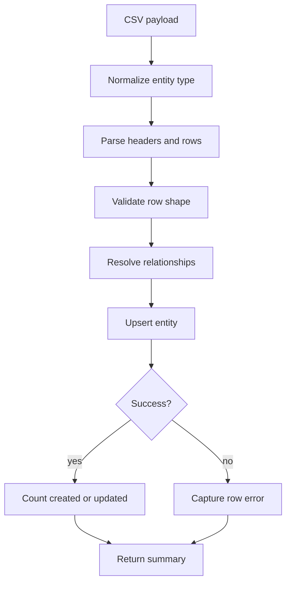

### Validation and mapping

The importer resolves relationships during import rather than expecting perfectly normalized payloads. It maps rows into domain entities, handles duplicate detection through business keys, and returns a summary with created, updated, skipped, and failed rows.

### Error handling

The service reports row-level failures instead of aborting the whole file when possible. This is important for bulk operations because one bad row should not necessarily block the entire import batch.

### Transaction boundaries

The source shows service-level persistence and per-row summary handling, but it does not expose a standalone transaction strategy beyond standard Spring service behavior. No more specific transactional guarantees should be claimed than the code supports.

## 15. Frontend Overview

The frontend is a route-driven operator console. It is not a separate product with its own business logic; it is the interface for the backend scheduling engine.

### Application structure

- `Layout` provides the shell.
- `Sidebar` groups navigation by workflow.
- `Header` displays the current screen title.
- `ToastContext` provides user feedback.
- The service layer wraps backend endpoints with typed functions.

### Major pages

- Resource maintenance pages for buildings, rooms, teachers, departments, batches, subjects, timeslots, and academic terms.
- Schedule generator and timetable viewer pages for the core workflow.
- Event and disruption pages for incremental repair.
- Analytics and what-if pages for operational analysis.
- Calendar portal and CSV import pages for distribution and bulk data operations.

### Backend interaction

The frontend communicates with the backend through a single Axios-based API layer. Most pages load data directly from that layer and manage their own local state for forms, tables, filters, and dialogs.

### Important frontend caveat

The constraint configuration screen is a frontend-only operator surface in the current source. There is no backend persistence endpoint for that configuration, so it should be understood as a local modeling UI rather than a persisted optimization settings store.

## 16. Design Patterns

The repository uses several patterns in a practical, non-theoretical way:

- Repository pattern for persistence access.
- Service layer pattern for business rules and orchestration.
- DTO pattern for request and response boundaries.
- Dependency injection for wiring controllers, services, and solver components.
- Builder-like construction for entity and planning problem assembly.
- Facade-style orchestration in schedule generation and disruption application.
- Graph traversal strategy in the impact engine.
- Planning entity / planning solution pattern from Timefold for solver modeling.

These patterns fit the architecture because the system has two distinct modes of work: transactional CRUD and search-based optimization. The code separates those concerns cleanly enough that the solver can evolve without collapsing the rest of the application.

## 17. Performance

### Solver complexity

The solver is the heaviest part of the system. Its cost depends on the size of the fact set, the number of sessions, and the constraint density. Larger departments will increase search space quickly, so the 30 second default termination is a pragmatic safety bound rather than an absolute quality guarantee.

### Graph traversal complexity

The impact graph builder uses pairwise connections within shared-resource groups. That means dense teacher, room, or batch groups can grow quadratically within each group. It is acceptable for the current design, but it is a point to watch as the dataset grows.

### Database considerations

- Hibernate validation and Flyway migrations keep schema drift under control.
- The solver and repair flows depend on correct indexing and relationship integrity.
- Deletion workflows intentionally clear dependent data before removing parent rows.

### Memory considerations

The solver and import pipelines both materialize in-memory object graphs. That is appropriate for the current scale, but very large institutions would need careful tuning around fact loading, session generation, and graph construction.

### Potential bottlenecks

- repeated constraint evaluations across large session sets
- dense shared-resource graphs during disruption analysis
- client-side tables when viewing large result sets
- large CSV imports if relationship resolution becomes expensive

## 18. REST API

The backend exposes versioned REST endpoints under `/api/v1`. The important ones are the scheduling, disruption, and bulk import APIs.

### Schedule generation endpoint

- Endpoint: `POST /api/v1/schedules/generate`
- Purpose: create a schedule and start solving
- Validation: feasibility is checked before solver launch
- Response: a schedule DTO with score and status

### Partial resolve endpoint

- Endpoint: `POST /api/v1/schedules/{id}/partial-resolve`
- Purpose: re-optimize only impacted sessions
- Validation: the target schedule must exist and the impacted set must be meaningful
- Response: updated schedule DTO

### Disruption endpoints

- Endpoint: `POST /api/v1/schedules/{id}/disruption/preview`
- Endpoint: `POST /api/v1/schedules/{id}/disruption/apply`
- Purpose: analyze impact and optionally apply it
- Response: impacted sessions or updated schedule

### CSV import endpoint

- Endpoint: `POST /api/v1/import/csv/{entityType}`
- Purpose: bulk import master data
- Validation: entity type must be supported and the CSV must match expected structure
- Response: import summary

### Export endpoints

- CSV export for solved schedules
- ICS export for teachers and batches

The source shows these as practical user-facing endpoints rather than a generic REST catalog, so the documentation focuses on the workflow endpoints that matter most to scheduling.

## 19. Troubleshooting

### Schedule generation fails early

Check the feasibility result first. The most common causes are missing timeslots, invalid subject chunking, unavailable teachers, or an impossible university configuration.

### The solver returns an infeasible schedule

This usually means the problem itself is over-constrained. Review room capacity, lab room requirements, teacher qualification coverage, and the timeslot topology.

### A disruption affects too many sessions

Inspect the dependency graph and the shared resources involved. Dense overlap through the same teacher, room, or batch will naturally enlarge the affected set.

### CSV import produces row errors

Verify entity type, header names, relationship tokens, and multi-value separators. The importer is intentionally strict about business keys and relationship shape.

### The constraint configuration screen does not change solver behavior

That is expected in the current code. The screen is not wired to a backend persistence mechanism.

## 20. Future Improvements

The source suggests several natural extension points:

- Externalize more scheduling weights and tuning knobs into persistent configuration.
- Add richer solver progress reporting from the backend if live feedback is needed.
- Reduce quadratic behavior in the disruption graph for very large schedules.
- Add more formal test coverage for schedule generation and partial resolve scenarios.
- Make export and import behaviors more discoverable in the frontend.

These are not required by the current source, but they are credible directions implied by the architecture.

## 21. Glossary

- Hard constraint: a rule that must not be violated.
- Medium constraint: a quality rule that should be minimized.
- Soft constraint: a preference that improves the result but is not required.
- Planning entity: an object Timefold is allowed to change during solving.
- Planning solution: the root object containing all solver facts and entities.
- Pre-allocation: a fixed or strongly preferred assignment.
- Partial resolve: re-optimization of only the sessions impacted by a disruption.
- Timeslot topology: the structure of days, breaks, and class periods available for scheduling.

## 22. Source Map

The codebase is organized by capability rather than by technical layer. The most important areas are:

- solver engine under `com.arare.features.solver`
- schedule orchestration under `com.arare.features.schedule`
- disruption handling under `com.arare.features.impact`
- bulk import under `com.arare.features.dataimport`
- master-data CRUD modules under the remaining `features.*` packages

The source also contains tests for the solver constraint provider, import service, class-session service, and impact analyzer.

## 23. Final Notes

This project is best understood as a framework-style scheduling platform rather than a collection of CRUD controllers. The solver, schedule engine, impact engine, and import engine are the real center of gravity, and this documentation is structured to teach that system from architecture down to execution flow.

All backend APIs are versioned under `/api/v1`.

### Academic Terms

Base path: `/api/v1/academic-terms`

| Method | Path | Purpose |
| --- | --- | --- |
| GET | `/` | List all academic terms |
| GET | `/{id}` | Fetch one term |
| POST | `/` | Create a term |
| PUT | `/{id}` | Update a term |
| DELETE | `/{id}` | Delete a term |

### Buildings

Base path: `/api/v1/buildings`

| Method | Path | Purpose |
| --- | --- | --- |
| GET | `/` | List buildings |
| GET | `/{id}` | Fetch one building |
| POST | `/` | Create building |
| PUT | `/{id}` | Update building |
| DELETE | `/{id}` | Delete building |

### Departments

Base path: `/api/v1/departments`

| Method | Path | Purpose |
| --- | --- | --- |
| GET | `/` | List departments |
| GET | `/{id}` | Fetch one department |
| POST | `/` | Create department |
| PUT | `/{id}` | Update department |
| DELETE | `/{id}` | Delete department |

### Rooms

Base path: `/api/v1/rooms`

| Method | Path | Purpose |
| --- | --- | --- |
| GET | `/` | List rooms |
| GET | `/{id}` | Fetch one room |
| GET | `/building/{buildingId}` | Filter by building |
| POST | `/` | Create room |
| PUT | `/{id}` | Update room |
| DELETE | `/{id}` | Delete room |

### Teachers

Base path: `/api/v1/teachers`

| Method | Path | Purpose |
| --- | --- | --- |
| GET | `/` | List teachers |
| GET | `/{id}` | Fetch one teacher |
| POST | `/` | Create teacher |
| PUT | `/{id}` | Update teacher |
| DELETE | `/{id}` | Delete teacher |

### Subjects

Base path: `/api/v1/subjects`

| Method | Path | Purpose |
| --- | --- | --- |
| GET | `/` | List subjects |
| GET | `/{id}` | Fetch one subject |
| GET | `/department/{departmentId}` | Filter by department |
| POST | `/` | Create subject |
| PUT | `/{id}` | Update subject |
| DELETE | `/{id}` | Delete subject |

### Batches

Base path: `/api/v1/batches`

| Method | Path | Purpose |
| --- | --- | --- |
| GET | `/` | List batches |
| GET | `/{id}` | Fetch one batch |
| GET | `/department/{departmentId}` | Filter by department |
| POST | `/` | Create batch |
| PUT | `/{id}` | Update batch |
| DELETE | `/{id}` | Delete batch |

### Class Sections

Base path: `/api/v1/class-sections`

| Method | Path | Purpose |
| --- | --- | --- |
| GET | `/` | List sections |
| GET | `/{id}` | Fetch one section |
| GET | `/batch/{batchId}` | Filter by batch |
| POST | `/` | Create section |
| PUT | `/{id}` | Update section |
| DELETE | `/{id}` | Delete section |

### Timeslots

Base path: `/api/v1/timeslots`

| Method | Path | Purpose |
| --- | --- | --- |
| GET | `/` | List timeslots |
| GET | `/{id}` | Fetch one timeslot |
| POST | `/` | Create timeslot |
| PUT | `/{id}` | Update timeslot |
| DELETE | `/{id}` | Delete timeslot |

### University Config

Base path: `/api/v1/university-config`

| Method | Path | Purpose |
| --- | --- | --- |
| GET | `/` | Get the active configuration |
| POST | `/` | Replace the active configuration |
| GET | `/diagnostics` | Check config vs timeslot topology |

### Pre-allocations

Base path: `/api/v1/pre-allocations`

| Method | Path | Purpose |
| --- | --- | --- |
| GET | `/schedule/{scheduleId}` | List allocations for one schedule |
| GET | `/{id}` | Fetch one allocation |
| POST | `/` | Create a pre-allocation |
| DELETE | `/{id}` | Delete a pre-allocation |

### Events

Base path: `/api/v1/events`

| Method | Path | Purpose |
| --- | --- | --- |
| GET | `/` | List events |
| GET | `/{id}` | Fetch one event |
| POST | `/` | Create event |
| PUT | `/{id}` | Update event |
| POST | `/{eventId}/apply/{scheduleId}` | Apply event to a schedule and re-optimize |
| DELETE | `/{id}` | Delete event |

### Schedules

Base path: `/api/v1/schedules`

| Method | Path | Purpose |
| --- | --- | --- |
| GET | `/` | List schedules |
| GET | `/{id}` | Fetch one schedule |
| POST | `/generate` | Create a schedule and run the solver |
| POST | `/{id}/partial-resolve` | Re-solve only impacted sessions |
| GET | `/{id}/score-explanation` | Return structured score breakdown |
| GET | `/{id}/explanation` | Return stored solver explanation text |
| GET | `/{id}/sessions` | Return solved sessions for the schedule |
| GET | `/{id}/sessions/{sessionId}/suggestions` | Return conflict suggestions for one session |
| DELETE | `/{id}` | Delete schedule and sessions |
| POST | `/{id}/disruption/preview` | Preview disruption impact |
| POST | `/{id}/disruption/apply` | Apply disruption and re-optimize |
| GET | `/{id}/export/csv` | Export timetable as CSV |
| GET | `/ical/teacher/{teacherId}` | Export teacher calendar |
| GET | `/ical/batch/{batchId}` | Export batch calendar |
| POST | `/feasibility-check` | Run pre-solve feasibility analysis |

### Class Sessions

Base path: `/api/v1/sessions`

| Method | Path | Purpose |
| --- | --- | --- |
| GET | `/schedule/{scheduleId}` | Sessions in a schedule |
| GET | `/schedule/{scheduleId}/batch/{batchId}` | Sessions for a batch in a schedule |
| GET | `/schedule/{scheduleId}/teacher/{teacherId}` | Sessions for a teacher in a schedule |
| PATCH | `/{id}` | Manually edit an assignment |

### CSV Import

Base path: `/api/v1/import/csv`

| Method | Path | Purpose |
| --- | --- | --- |
| POST | `/{entityType}` | Import CSV into one entity family |

### Example payloads

#### Generate schedule

```json
{
  "name": "Schedule 2026-07-13",
  "scope": "DEPARTMENT",
  "parentScheduleId": 12,
  "departmentId": 4,
  "batchIds": [1, 2],
  "teacherIds": [7, 8],
  "roomIds": [15, 16],
  "solvingTimeSeconds": 30
}
```

#### Manual session assignment

```json
{
  "teacherId": 7,
  "roomId": 15,
  "timeslotId": 101,
  "locked": true,
  "clearTeacher": false,
  "clearRoom": false,
  "clearTimeslot": false
}
```

#### CSV import request

```json
{
  "csvContent": "day,startTime,endTime,slotNumber,type\nMONDAY,09:00,10:00,1,CLASS"
}
```

## 11. Solver Engine

The solver engine is the most important part of the repository.

### Solver architecture

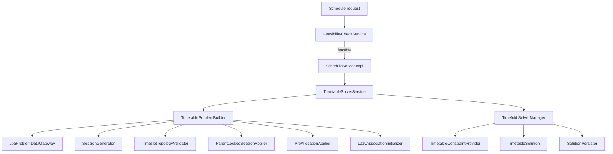

### Planning solution

File: `features/solver/TimetableSolution.java`

`TimetableSolution` is the Timefold root object.

Problem facts:

- `timeslots` as the CLASS-slot value range.
- `rooms` as the room value range.
- `teachers` as the teacher value range.
- `subjects`, `batches`, `classSections`, `buildings`, and `configs` as read-only supporting facts.

Planning entities:

- `sessions` of type `ClassSession`.

Score:

- `HardMediumSoftScore`.

The solution is built around the assumption that all required sessions are pre-generated before the search starts.

### Problem construction

File: `features/solver/TimetableProblemBuilder.java`

Responsibilities:

- Load all required facts.
- Validate topology against the university configuration.
- Load or generate sessions.
- Apply parent schedule locking when a schedule is derived from another schedule.
- Apply explicit pre-allocations.
- Lock sessions outside the partial re-solve set.
- Force lazy associations to initialize before Timefold uses them.

Lifecycle:

1. Load facts using `ProblemDataGateway`.
2. Validate timeslot topology.
3. Resolve an existing session set or generate a new one.
4. Apply parent-locked assignments if a parent schedule exists.
5. Apply locked pre-allocations.
6. Lock sessions outside the impacted subset during partial re-solve.
7. Initialize associations.
8. Return a `TimetableSolution`.

### Fact loading gateway

File: `features/solver/JpaProblemDataGateway.java`

Responsibilities:

- Load current JPA entities into solver facts.
- Restrict room, teacher, batch, and subject sets according to `ProblemBuildRequest`.
- Load only `TimeslotType.CLASS` timeslots.
- Load the active university configuration.
- Return existing sessions for a schedule.
- Save newly generated sessions.
- Find locked sessions from a parent schedule.
- Find locked pre-allocations.

Important behavior:

- If a department is selected, subjects and batches are filtered by that department.
- If batch IDs are provided, batches are narrowed further.
- `ClassSection` facts are loaded by batch IDs when available.

### Session generation

File: `features/solver/StandardSessionGenerator.java`

The generator expands a schedule into concrete `ClassSession` rows.

Algorithm:

1. Sort subjects by descending `chunkHours` so larger blocks are considered first.
2. Iterate each batch.
3. Skip subjects outside the batch’s department.
4. Validate that `weeklyHours` is divisible by `chunkHours`.
5. Compute session count as `weeklyHours / chunkHours`.
6. For lab subjects, attempt whole-batch placement first.
7. If the room inventory cannot handle the full batch, try splitting across class sections.
8. If even section-level assignment is not feasible, fall back to whole-batch generation.
9. Create unlocked sessions with `duration = chunkHours`.

Design intent:

- Labs are split more carefully than lectures.
- Larger chunks are handled first to expose feasibility problems early.

### Timeslot topology validation

File: `features/solver/TimeslotTopologyValidator.java`

This validator protects the solver from impossible topology mismatches.

Checks:

- If working days are configured, they must match `daysPerWeek` in count.
- Each configured working day must have at least one CLASS timeslot.
- If no explicit working days exist, there must still be enough distinct CLASS days for the configured week length.
- Break slot indices cannot be negative.

### Parent lock propagation

File: `features/solver/ParentLockedSessionApplier.java`

Purpose:

- Preserve locked assignments from a parent schedule when generating a derivative schedule.

Matching key:

- `subjectId`
- effective batch ID
- `sectionId`
- `duration`

Behavior:

- Child sessions are grouped by the matching key and sorted by ID.
- Parent locked sessions are applied to child sessions in stable order.
- If the child schedule lacks enough matching sessions, extra parent locks are skipped.

### Pre-allocation application

File: `features/solver/PreAllocationApplier.java`

Purpose:

- Force one matching session per pre-allocation into the specified teacher, room, and timeslot.
- Mark those sessions locked.

Matching logic:

- Same subject.
- Same batch.
- Session must not already be locked.

### Lazy association initialization

File: `features/solver/LazyAssociationInitializer.java`

Purpose:

- Touch nested associations before the solver sees the entities.

This prevents solver-side lazy-loading surprises when constraints inspect departments, buildings, subjects, batches, rooms, and sections.

### Solver service

File: `features/solver/TimetableSolverService.java`

Key methods:

- `solveSchedule(...)`
- `partialResolve(...)`
- `explainSchedule(...)`
- `persistSolution(...)`

Solver execution flow:

1. Fetch the target schedule.
2. Build a problem instance.
3. Run Timefold through `SolverManager` with a UUID problem ID.
4. Apply a per-call termination override when provided.
5. Wait for the final best solution.
6. Persist solved assignments.

The default solving window is 30 seconds when no custom limit is supplied.

### Constraint model

File: `features/solver/TimetableConstraintProvider.java`

This class defines the score semantics.

The constraints are organized into three layers:

#### Hard constraints

- Teacher conflict
- Room conflict
- Batch conflict
- Room capacity violation
- Room type mismatch
- Section conflict
- Teacher not qualified for subject
- Teacher unavailable at timeslot
- Room unavailable at timeslot
- Session assigned to break or blocked slot
- Teacher required but not assigned
- Teacher assigned though not required
- Lab teacher required
- Room required but not assigned
- Lab multi-slot crosses non-consecutive slot
- Multi-slot session missing slot numbering

#### Medium constraints

- Teacher daily hours exceeded
- Teacher weekly hours exceeded
- Teacher consecutive classes exceeded
- Batch missing midday break
- Student idle gap
- Teacher idle gap
- Split lab sections not aligned in time
- Session outside department buildings
- Different teachers assigned to same subject for same batch
- Same subject scheduled twice on same day
- Teacher building movement minimization

#### Soft constraints

- Teacher free day violated
- Batch free day violated
- Teacher building preference violated
- Subject spread across week
- Batch building stability
- Room stability
- Prefer non-lab multi-slot consecutive placement

Constraint design notes:

- Hard constraints prevent invalid timetables.
- Medium constraints express quality or wellness preferences.
- Soft constraints represent desirable but optional choices.

### Score explanation

File: `features/solver/ScoreExplanationResponse.java`

The solver service exposes a UI-friendly summary of the score:

- Overall score string
- Feasibility flag
- Hard, medium, and soft totals
- Per-constraint breakdown entries

Each breakdown entry includes:

- Constraint name
- Severity level
- Match count
- Score impact string

### Solution persistence

File: `features/solver/SolutionPersister.java`

Responsibilities:

- Reject infeasible results with negative hard scores.
- Write schedule score and score explanation back to the schedule record.
- Copy solved teacher, room, timeslot, and lock state back to managed `ClassSession` rows.
- Log solved assignments for traceability.

Important behavior:

- If the score is null or hard score is negative, persistence is aborted.
- The schedule status is set to `ACTIVE` for feasible solutions and `INFEASIBLE` when the score is null or the hard score is negative.

Potential bug:

- The error branch builds a message using `score.hardScore()` even when `score` can be null. That would throw a `NullPointerException` before the intended exception is thrown.

### Solver lifecycle

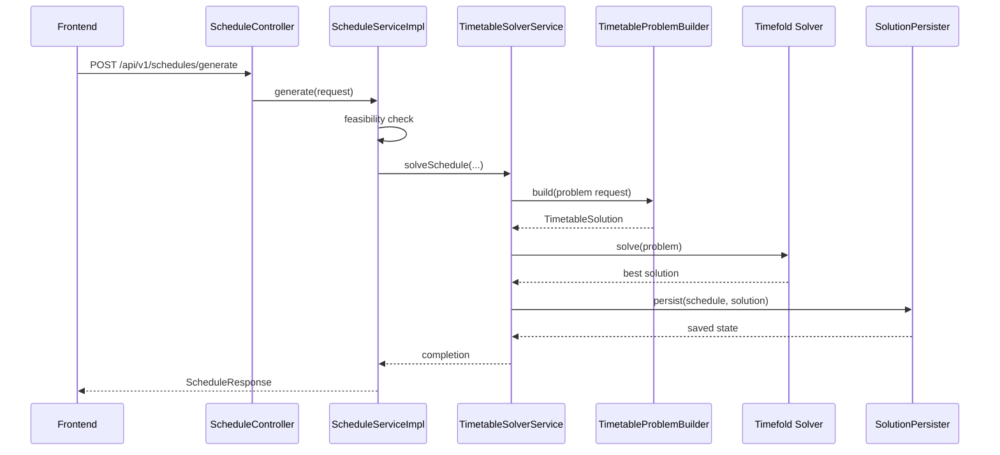

## 12. Scheduling Engine

### Feasibility check

File: `features/schedule/FeasibilityCheckService.java`

Purpose:

- Perform a fast pre-solver validation pass.

What it checks:

- Whether batches exist for the selected scope.
- Whether teachers and rooms are available.
- Whether CLASS timeslots exist.
- Whether subjects have valid chunking.
- Whether at least one qualified teacher exists for teacher-required subjects.
- Whether lab subjects have matching room types.
- Whether class-section topology exists for lab splitting.
- Whether per-batch demand exceeds available CLASS timeslots.
- Whether the estimated teacher-slot capacity is too low.
- Whether any subject needs more sessions than available timeslots.

This service is intentionally lightweight and is intended to run before the user launches the solver.

### Schedule generation service

File: `features/schedule/ScheduleServiceImpl.java`

Responsibilities:

- Validate feasibility first.
- Optionally resolve a parent schedule.
- Create a draft schedule record.
- Launch the solver.
- Return the stored response.
- Provide score explanation, raw explanation text, session lookup, delete, partial resolve, and conflict suggestions.

Important behavior:

- Generation is blocked if the feasibility check returns errors.
- Partial resolve locks all sessions except the impacted set.
- Deleting a schedule deletes its sessions first.

### Conflict suggestions

The schedule service includes a heuristic suggestion generator for an individual session.

Behavior:

- It iterates over every CLASS timeslot.
- It counts hard conflicts against the target session for teacher, room, and batch collisions.
- It counts soft penalties for same-subject same-day placement inside the same batch.
- Results are ordered by hard conflicts, then soft penalties, then label.

Response model:

- `ConflictSuggestionResponse` includes the timeslot ID, readable label, preview message, score hint, hard conflict count, and soft penalty count.

### Timetable export

File: `features/schedule/TimetableExportService.java`

Purpose:

- Export a solved schedule to CSV.

Behavior:

- Prepends a UTF-8 BOM for Excel compatibility.
- Orders sessions by day and start time.
- Excludes unassigned sessions from the main CSV rows and notes their count at the end.

### Calendar export

File: `features/schedule/TimetableCalendarExportService.java`

Purpose:

- Export teacher and batch calendars as ICS data.

Behavior:

- Uses the active schedule when no schedule ID is provided.
- Emits weekly recurring events with a 16-week default recurrence count.
- Builds event summaries, locations, and descriptions from session data.
- Escapes ICS text values correctly.

### Schedule request/response DTOs

- `ScheduleRequest` carries name, scope, parent schedule ID, scope filters, and solver time.
- `ScheduleResponse` returns ID, name, scope, status, parent schedule ID, score, score explanation, and created timestamp.

### Scheduling flow

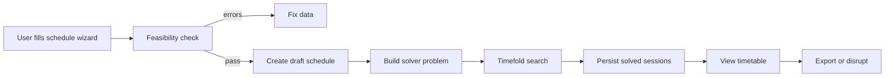

## 13. Impact Engine

The impact package models how external changes ripple through a schedule.

### Core types

- `DisruptionType` identifies the disruption kind.
- `DisruptionRequest` is the input DTO.
- `DisruptionResponse` is the preview result.
- `SessionNode` is an in-memory graph node.
- `DependencyEdge` is a directed edge.
- `DependencyType` describes whether the edge is teacher, room, or batch based.
- `DependencyGraph` stores nodes and adjacency lists.
- `DependencyGraphBuilder` constructs the graph.
- `ImpactAnalyzer` runs a BFS over the graph.
- `DisruptionServiceImpl` coordinates preview and application.

### Graph construction

File: `features/impact/DependencyGraphBuilder.java`

The graph is built per schedule and is not persisted.

Nodes are created for every session.

Edges are created for sessions sharing:

- the same teacher
- the same room
- the same batch

The builder creates pairwise edges within each resource group.

Complexity:

- Worst case O(n²) within each resource group.
- In practice the groups are small enough that this is acceptable.

### Impact analysis

File: `features/impact/ImpactAnalyzer.java`

Algorithm:

1. Seed the queue with sessions directly affected by the disruption.
2. For timeslot-block disruptions, also seed unassigned sessions so they are not later moved into the blocked slot.
3. Run BFS across dependency edges.
4. Stop expanding from locked sessions, but keep them in the impacted set.

Directly affected session rules:

- Teacher unavailability matches teacher ID and day.
- Room unavailability matches room ID and day.
- Timeslot blocking matches timeslot ID.
- Session cancellation matches session ID.
- Special events match by day.

### Disruption service

File: `features/impact/DisruptionServiceImpl.java`

Preview flow:

1. Validate the schedule exists.
2. Validate the request shape.
3. Build the dependency graph from current schedule sessions.
4. Analyze the disruption.
5. Return impacted session summaries.

Apply flow:

1. Run the same preview analysis.
2. If no sessions are impacted, return the current schedule unchanged.
3. Otherwise call `ScheduleService.partialResolve(...)` with the impacted session IDs.

### Event bridge

File: `features/event/EventServiceImpl.java`

An `Event` can be applied to a schedule.

Behavior:

- For each day in the event date range, the service previews room, teacher, and timeslot disruptions.
- If the event does not target any specific resources, it is treated as a special event disruption.
- The impacted session IDs are merged into a set.
- If anything is impacted, the solver is run again for only those sessions.

### Impact sequence

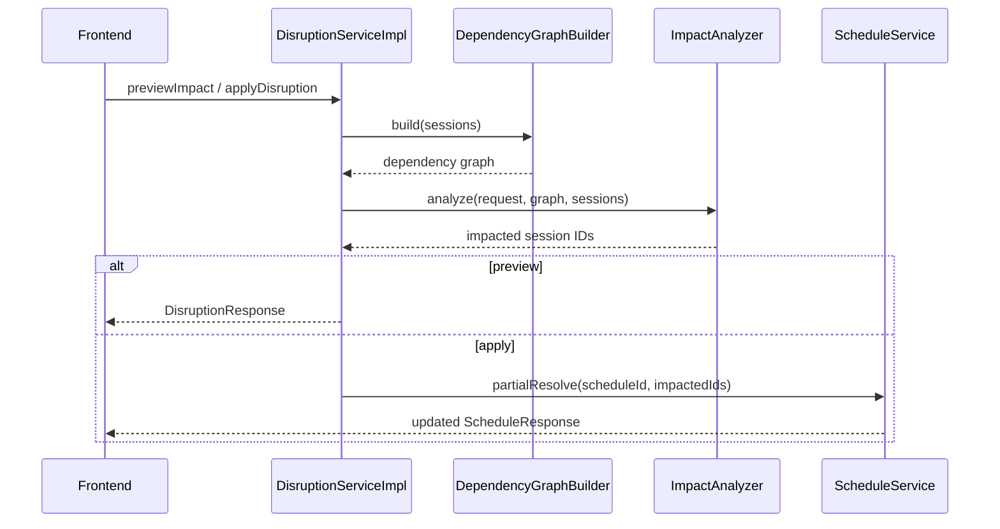

## 14. Import Engine

### CSV import service

File: `features/dataimport/CsvImportService.java`

Supported entity types:

- `timeslots`
- `buildings`
- `departments`
- `rooms`
- `subjects`
- `teachers`
- `batches`

Input handling:

- Normalizes entity type casing.
- Parses CSV text in-memory.
- Removes a UTF-8 BOM from headers.
- Treats blank lines as ignorable.
- Uses `;` or `|` for multi-value fields.

Upsert behavior:

- Timeslots are matched by day + start/end time.
- Buildings are matched by name ignoring case.
- Departments are matched by code ignoring case.
- Rooms are matched by building + room number.
- Subjects are matched by department plus either code or name.
- Teachers are matched by name.
- Batches are matched by department/year/section.

Relationship resolution:

- Department building associations are resolved by building names.
- Teacher subject IDs are resolved by subject codes.
- Teacher availability and room availability are resolved from timeslot tokens.
- Batch working days are parsed into `SchoolDay` values.

Known CSV token formats:

- Timeslot tokens: `DAY@HH:mm-HH:mm`
- Subject tokens: either `CODE` or `DEPT:CODE`
- Multi-value lists: `;` or `|`

The importer returns a summary containing created, updated, skipped, and per-row errors.

### CSV import flow

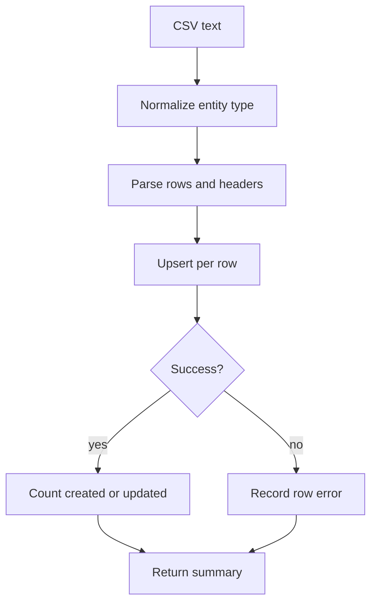

### CSV import controller

File: `features/dataimport/CsvImportController.java`

- `POST /api/v1/import/csv/{entityType}`
- Accepts a `CsvImportRequest` containing raw CSV text.

## 15. Frontend Architecture

The frontend is a single-page application with route-driven screens.

### Route map

File: `frontend/src/App.tsx`

| Route | Page |
| --- | --- |
| `/dashboard` | Dashboard |
| `/buildings` | Buildings |
| `/rooms` | Rooms |
| `/teachers` | Teachers |
| `/subjects` | Subjects |
| `/departments` | Departments |
| `/batches` | Batches |
| `/sections` | Class Sections |
| `/timeslots` | Timeslots |
| `/config` | University Configuration |
| `/schedule/generate` | Schedule Generator |
| `/schedule/view/:id` | Timetable Viewer |
| `/schedule/history` | Schedule History |
| `/events` | Events |
| `/disruptions` | Disruption Handling |
| `/academic-terms` | Academic Terms |
| `/analytics` | Analytics Dashboard |
| `/what-if` | What-If Comparison |
| `/portal` | Calendar Portal |
| `/constraints` | Constraint Config |
| `/import/csv` | CSV Import |

### Shell

- `Layout` renders the sidebar, header, and main outlet.
- `Header` changes the title based on pathname.
- `Sidebar` groups navigation into Overview, Scheduling, Resources, Academics, and Configuration.

### Frontend API layer

File: `frontend/src/services/api.ts`

This file defines:

- one Axios instance with a `/api/v1` base URL
- a response interceptor that normalizes error messages
- typed wrappers for all backend endpoints

The frontend mostly uses direct HTTP calls rather than a shared query cache, so pages are responsible for their own loading and refresh behavior.

### Frontend design system

Shared UI primitives are in `frontend/src/components/ui`.

- `Button` supports variants, sizes, loading state, and optional icons.
- `Card` wraps sections with title, description, and action slots.
- `Input` and `Select` provide labeled fields with help/error text.
- `Modal` provides Escape-key close behavior and a portal-based dialog.
- `ConfirmDialog` provides destructive action confirmation.
- `Table` supports search, sort, selection, and custom row context menus.
- `Toast` renders portal-based notifications.
- `AvailabilityPainter` is a grid interaction component for selecting timeslots.
- `Badge` is used for status/type chips.
- `Spinner` is the loading indicator.
- `ContextMenu` renders right-click menus.

### Timetable viewer

File: `frontend/src/pages/TimetableViewer.tsx`

This is the most complex frontend screen.

It combines:

- a filtered timetable grid
- a solver score inspector
- a conflict suggestion sidecar
- manual session editing
- heatmap-like risk highlighting
- disruption preview and apply controls

The page loads schedule metadata, sessions, timeslots, batches, teachers, and rooms in parallel.

The viewer can:

- toggle between batch, teacher, and room views
- drag sessions to a new timeslot
- inspect hard and soft penalties for a selected session
- preview schedule disruption impact
- apply a disruption and re-optimize
- export CSV
- open teacher and batch iCal links

### Schedule generator

File: `frontend/src/pages/ScheduleGenerator.tsx`

This page acts as a multi-step wizard.

Steps:

1. Scope selection
2. Resource selection
3. Constraint priorities
4. Solver tuning

It can run a feasibility check before generation.

The page also presents a fake solver progress dashboard while solving is in flight. The progress visualization is client-side UI feedback; it does not stream actual solver telemetry from the backend.

### Schedule history

File: `frontend/src/pages/ScheduleHistory.tsx`

Purpose:

- List all generated schedules.
- Open a schedule.
- Continue from a schedule by generating a derived schedule.
- Delete schedules.

### Disruption handling

File: `frontend/src/pages/DisruptionHandling.tsx`

Purpose:

- Pick an active schedule.
- Choose an event.
- Apply the event and trigger partial re-optimization.

### Events

File: `frontend/src/pages/Events.tsx`

Purpose:

- Create disruption events.
- Attach teachers, rooms, and timeslots.
- Apply a stored event to a target schedule.

### Analytics and comparison pages

Files:

- `frontend/src/pages/AnalyticsDashboard.tsx`
- `frontend/src/pages/WhatIfComparison.tsx`

Analytics uses Recharts to show teacher load, room occupancy, and a radar of schedule quality signals.

What-if comparison compares two schedules using score parsing and session-derived coverage metrics.

### Calendar portal

File: `frontend/src/pages/CalendarPortal.tsx`

Purpose:

- Generate copyable iCal URLs.
- Download teacher or batch calendar files.

### Constraint config

File: `frontend/src/pages/ConstraintConfig.tsx`

Important note:

- This screen is frontend-only state. There is no backend endpoint that persists these tuning weights.
- The page is a local tuning mockup and should not be described as a persisted optimization configuration store.

### CSV import page

File: `frontend/src/pages/CsvImport.tsx`

Purpose:

- Paste or upload CSV text.
- Load templates and example data packs.
- Submit CSV to the backend import API.

## 16. Frontend Data Model

File: `frontend/src/types/index.ts`

The frontend mirrors the backend DTOs with TypeScript interfaces and string-literal enums.

Important frontend-only notes:

- `UniversityConfig` and `UniversityConfigRequest` include an `active` field in the TypeScript model, but the backend save endpoint always activates the saved configuration.
- `Schedule` and `ClassSession` include derived display fields that are assembled by the backend response mapping.
- `DisruptionResponse` and `FeasibilityCheckResult` are directly used to render solver diagnostics in the UI.

## 17. Request Flow

### CRUD flow

1. The page fetches data from a typed service wrapper.
2. The service calls Axios.
3. The backend controller validates and delegates to a service.
4. The service resolves relationships, normalizes input, and persists entities.
5. The controller returns a response DTO.

### Schedule generation flow

1. The frontend wizard collects scope and resource filters.
2. The feasibility check runs first.
3. If feasible, the backend creates a draft schedule and launches Timefold.
4. The solver builds a `TimetableSolution` and optimizes it.
5. The solver result is persisted and returned.
6. The viewer page loads the schedule and sessions.

### Disruption flow

1. An event or disruption is selected.
2. The backend builds a dependency graph from current sessions.
3. The BFS analyzer identifies impacted sessions.
4. If applying the disruption, the backend partially re-solves only those sessions.

## 18. Performance Notes

Strengths:

- Solve-time facts are loaded once per generation.
- Disruption analysis uses an in-memory graph rather than repeated database joins during BFS.
- Many UI pages load data in parallel with `Promise.allSettled`.
- CSV import is batched in-memory rather than using row-by-row HTTP calls.

Tradeoffs and constraints:

- The constraint provider joins on multiple resource dimensions and can grow expensive on large timetables.
- `DependencyGraphBuilder` is pairwise within resource groups, so large shared-resource groups will grow quadratically.
- `Table` filtering and sorting are client-side.
- The frontend solver progress dashboard is cosmetic and not telemetry-driven.

## 19. Testing

Existing backend tests:

- `src/test/java/com/arare/features/solver/TimetableConstraintProviderTest.java`
- `src/test/java/com/arare/features/dataimport/CsvImportServiceTest.java`
- `src/test/java/com/arare/features/classsession/ClassSessionServiceImplTest.java`
- `src/test/java/com/arare/features/impact/ImpactAnalyzerTest.java`

What they verify:

- Medium constraints remain medium and do not accidentally become hard constraints.
- Timeslot import handles BOM-stripped CSV headers.
- Session assignment clearing respects the manual clear flags.
- Timeslot blocking and special-event impact propagation behave as expected.

Test runtime configuration:

- `src/test/resources/application.properties` uses H2 in PostgreSQL compatibility mode.
- Hibernate uses `create-drop` in tests.
- Flyway is disabled in tests.

## 20. Troubleshooting

### Solver reports infeasible

Check:

- `timeslots` exist and are of type `CLASS` where needed.
- `UniversityConfig` matches the timeslot topology.
- Subjects have valid `weeklyHours`/`chunkHours` divisibility.
- At least one qualified teacher exists for each teacher-required subject.
- Required room types and lab subtypes exist.

### A deletion fails with a foreign key or reference error

The service layer usually cleans dependent rows first, but manually deleting a referenced entity outside the service layer can still fail. The global exception handler converts many data integrity failures into readable conflict responses.

### Calendar export does not show data

Check that the schedule exists and contains sessions with assigned timeslots. Calendar exports only include sessions with timeslots.

### CSV import does not behave as expected

Check header normalization, token formats, and the recommended import order. Multi-value fields use `;` or `|`, and timeslot tokens use `DAY@HH:mm-HH:mm`.

### ConstraintConfig page changes do not affect the backend

That is expected from the source. The page is currently a local-only tuning surface and is not wired to a backend persistence endpoint.

## 21. Known Limitations and Risks

- `SolutionPersister` has a null-score error path that can dereference `score` while it is null.
- The frontend solver progress chart is synthetic UI feedback rather than actual search progress from the backend.
- No persistent backend API exists for the ConstraintConfig page.
- Several services assume invariant-clean entities and may throw if entities are malformed outside the normal service flow.
- `TimetableConstraintProvider` contains complex constraints; behavior is best understood through the source and the tests.

## 22. Extension Guide

### Adding a new master-data entity

1. Create the entity under `features/<module>`.
2. Extend `BaseEntity` if auditing and versioning are needed.
3. Add repository, request DTO, response DTO, service interface, service impl, and controller.
4. Add frontend service wrapper, page, and navigation entry if the UI should manage it.
5. Add tests for validation and delete behavior.

### Adding a new constraint

1. Add the rule in `TimetableConstraintProvider`.
2. Decide whether it is hard, medium, or soft.
3. Update `ScoreExplanationResponse` presentation if needed.
4. Add a constraint verifier test.

### Adding a new disruption type

1. Extend `DisruptionType`.
2. Update `DisruptionRequest`, `DisruptionResponse`, and the analyzer switch logic.
3. Update the event bridge if events should create the new disruption.
4. Update frontend type definitions and pages.

## 23. Design Patterns

- Repository pattern is used throughout the persistence layer.
- DTO pattern separates request and response shapes from entities.
- Service layer pattern centralizes business rules.
- Facade-style orchestration appears in schedule generation and disruption application.
- Strategy-like behavior appears in the constraint provider through separate constraint methods.
- Dependency injection is pervasive in Spring-managed components.
- Planning entity / planning solution is the Timefold domain model pattern.
- Builder pattern is used heavily for entities and records.

## 24. Glossary

- `Hard score`: a rule that must not be violated.
- `Medium score`: a quality rule that should be minimized.
- `Soft score`: a preference rule.
- `CLASS timeslot`: a schedulable slot.
- `BREAK timeslot`: a non-schedulable break period.
- `BLOCKED timeslot`: a manually forbidden period.
- `Pre-allocation`: a fixed assignment the solver should honor.
- `Locked session`: a session the solver must not change.
- `Partial resolve`: re-optimization of only impacted sessions.

## 25. Appendix: Source Inventory

### Backend source files

Main application and shared files:

- `src/main/java/com/arare/ArareApplication.java`
- `src/main/java/com/arare/common/BaseEntity.java`
- `src/main/java/com/arare/config/JpaConfig.java`
- `src/main/java/com/arare/utils/Constants.java`
- `src/main/java/com/arare/exception/GlobalExceptionHandler.java`
- `src/main/java/com/arare/exception/ResourceNotFoundException.java`
- `src/main/java/com/arare/exception/DuplicateResourceException.java`

Feature modules:

- `features/academicterm/AcademicTerm.java`
- `features/academicterm/AcademicTermController.java`
- `features/academicterm/AcademicTermRepository.java`
- `features/academicterm/AcademicTermRequest.java`
- `features/academicterm/AcademicTermResponse.java`
- `features/academicterm/AcademicTermService.java`
- `features/academicterm/AcademicTermServiceImpl.java`
- `features/batch/Batch.java`
- `features/batch/BatchController.java`
- `features/batch/BatchRepository.java`
- `features/batch/BatchRequest.java`
- `features/batch/BatchResponse.java`
- `features/batch/BatchService.java`
- `features/batch/BatchServiceImpl.java`
- `features/building/Building.java`
- `features/building/BuildingController.java`
- `features/building/BuildingRepository.java`
- `features/building/BuildingRequest.java`
- `features/building/BuildingResponse.java`
- `features/building/BuildingService.java`
- `features/building/BuildingServiceImpl.java`
- `features/classsection/ClassSection.java`
- `features/classsection/ClassSectionController.java`
- `features/classsection/ClassSectionRepository.java`
- `features/classsection/ClassSectionRequest.java`
- `features/classsection/ClassSectionResponse.java`
- `features/classsection/ClassSectionService.java`
- `features/classsection/ClassSectionServiceImpl.java`
- `features/classsession/ClassSession.java`
- `features/classsession/ClassSessionController.java`
- `features/classsession/ClassSessionRepository.java`
- `features/classsession/ClassSessionResponse.java`
- `features/classsession/ClassSessionService.java`
- `features/classsession/ClassSessionServiceImpl.java`
- `features/classsession/SessionAssignmentRequest.java`
- `features/dataimport/CsvImportController.java`
- `features/dataimport/CsvImportRequest.java`
- `features/dataimport/CsvImportResponse.java`
- `features/dataimport/CsvImportService.java`
- `features/department/Department.java`
- `features/department/DepartmentController.java`
- `features/department/DepartmentRepository.java`
- `features/department/DepartmentRequest.java`
- `features/department/DepartmentResponse.java`
- `features/department/DepartmentService.java`
- `features/department/DepartmentServiceImpl.java`
- `features/event/Event.java`
- `features/event/EventController.java`
- `features/event/EventRepository.java`
- `features/event/EventRequest.java`
- `features/event/EventResponse.java`
- `features/event/EventService.java`
- `features/event/EventServiceImpl.java`
- `features/impact/DependencyEdge.java`
- `features/impact/DependencyGraph.java`
- `features/impact/DependencyGraphBuilder.java`
- `features/impact/DependencyType.java`
- `features/impact/DisruptionRequest.java`
- `features/impact/DisruptionResponse.java`
- `features/impact/DisruptionService.java`
- `features/impact/DisruptionServiceImpl.java`
- `features/impact/DisruptionType.java`
- `features/impact/ImpactAnalyzer.java`
- `features/impact/SessionNode.java`
- `features/preallocation/PreAllocation.java`
- `features/preallocation/PreAllocationController.java`
- `features/preallocation/PreAllocationRequest.java`
- `features/preallocation/PreAllocationResponse.java`
- `features/preallocation/PreAllocationRepository.java`
- `features/preallocation/PreAllocationService.java`
- `features/preallocation/PreAllocationServiceImpl.java`
- `features/room/Room.java`
- `features/room/RoomController.java`
- `features/room/RoomRepository.java`
- `features/room/RoomRequest.java`
- `features/room/RoomResponse.java`
- `features/room/RoomService.java`
- `features/room/RoomServiceImpl.java`
- `features/schedule/ConflictSuggestionResponse.java`
- `features/schedule/FeasibilityCheckResult.java`
- `features/schedule/FeasibilityCheckService.java`
- `features/schedule/FeasibilityIssue.java`
- `features/schedule/Schedule.java`
- `features/schedule/ScheduleController.java`
- `features/schedule/ScheduleRepository.java`
- `features/schedule/ScheduleRequest.java`
- `features/schedule/ScheduleResponse.java`
- `features/schedule/ScheduleService.java`
- `features/schedule/ScheduleServiceImpl.java`
- `features/schedule/TimetableCalendarExportService.java`
- `features/schedule/TimetableExportService.java`
- `features/solver/JpaProblemDataGateway.java`
- `features/solver/LazyAssociationInitializer.java`
- `features/solver/ParentLockedSessionApplier.java`
- `features/solver/PreAllocationApplier.java`
- `features/solver/ProblemBuildRequest.java`
- `features/solver/ProblemDataGateway.java`
- `features/solver/ProblemFacts.java`
- `features/solver/ScoreExplanationResponse.java`
- `features/solver/SessionGenerator.java`
- `features/solver/SolutionPersister.java`
- `features/solver/StandardSessionGenerator.java`
- `features/solver/TimeslotTopologyValidator.java`
- `features/solver/TimetableConstraintProvider.java`
- `features/solver/TimetableProblemBuilder.java`
- `features/solver/TimetableSolution.java`
- `features/solver/TimetableSolverService.java`
- `features/subject/Subject.java`
- `features/subject/SubjectController.java`
- `features/subject/SubjectRepository.java`
- `features/subject/SubjectRequest.java`
- `features/subject/SubjectResponse.java`
- `features/subject/SubjectService.java`
- `features/subject/SubjectServiceImpl.java`
- `features/teacher/Teacher.java`
- `features/teacher/TeacherController.java`
- `features/teacher/TeacherRepository.java`
- `features/teacher/TeacherRequest.java`
- `features/teacher/TeacherResponse.java`
- `features/teacher/TeacherService.java`
- `features/teacher/TeacherServiceImpl.java`
- `features/timeslot/Timeslot.java`
- `features/timeslot/TimeslotController.java`
- `features/timeslot/TimeslotRepository.java`
- `features/timeslot/TimeslotRequest.java`
- `features/timeslot/TimeslotResponse.java`
- `features/timeslot/TimeslotService.java`
- `features/timeslot/TimeslotServiceImpl.java`
- `features/universityconfig/UniversityConfig.java`
- `features/universityconfig/UniversityConfigController.java`
- `features/universityconfig/UniversityConfigDiagnosticsResponse.java`
- `features/universityconfig/UniversityConfigRepository.java`
- `features/universityconfig/UniversityConfigRequest.java`
- `features/universityconfig/UniversityConfigResponse.java`
- `features/universityconfig/UniversityConfigService.java`
- `features/universityconfig/UniversityConfigServiceImpl.java`

### Frontend source files

- `frontend/index.html`
- `frontend/package.json`
- `frontend/postcss.config.js`
- `frontend/tailwind.config.js`
- `frontend/tsconfig.json`
- `frontend/tsconfig.node.json`
- `frontend/vite.config.ts`
- `frontend/src/App.tsx`
- `frontend/src/main.tsx`
- `frontend/src/index.css`
- `frontend/src/contexts/ToastContext.tsx`
- `frontend/src/hooks/useUnsavedChanges.ts`
- `frontend/src/lib/utils.ts`
- `frontend/src/services/api.ts`
- `frontend/src/services/*.ts` wrappers for all major entity APIs
- `frontend/src/types/index.ts`
- `frontend/src/components/layout/*.tsx`
- `frontend/src/components/solver/SolverProgressDashboard.tsx`
- `frontend/src/components/timetable/*.tsx`
- `frontend/src/components/ui/*.tsx`
- `frontend/src/pages/*.tsx`

### Tests

- `src/test/java/com/arare/features/solver/TimetableConstraintProviderTest.java`
- `src/test/java/com/arare/features/dataimport/CsvImportServiceTest.java`
- `src/test/java/com/arare/features/classsession/ClassSessionServiceImplTest.java`
- `src/test/java/com/arare/features/impact/ImpactAnalyzerTest.java`
