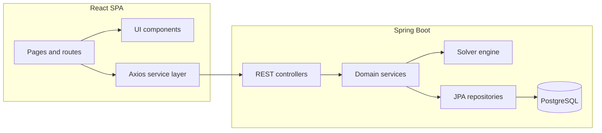
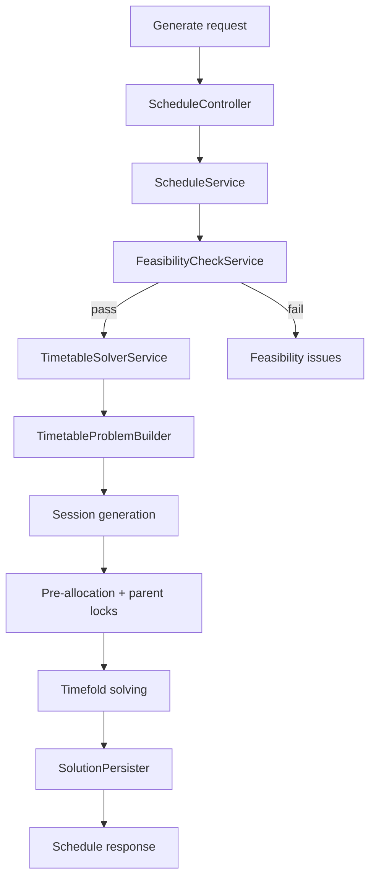
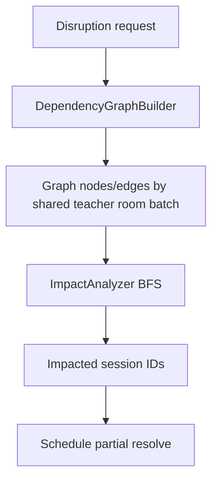

# ARARE

Adaptive Real-Time Analysis and Re-evaluation Engine for university timetable scheduling.

ARARE is a full-stack scheduling platform built with Spring Boot, Timefold, and React. It manages academic master data, generates optimized schedules, analyzes disruptions, and supports export/import workflows.

This document is the primary technical guide for the repository. It is based on the source code and avoids unsupported assumptions.

## 1. Introduction

ARARE solves a constrained timetable optimization problem for universities.

Core operator workflow:

1. Maintain master data (departments, batches, teachers, rooms, subjects, timeslots).
2. Define active university scheduling configuration.
3. Run schedule generation with Timefold.
4. Inspect score and timetable quality.
5. Apply disruptions/events and partially re-solve impacted sessions.
6. Export schedule artifacts (CSV, iCal).

## 2. System Overview

The system has three runtime concerns:

- Transactional domain management: CRUD + relationship integrity.
- Optimization lifecycle: planning model build, solving, scoring, persistence.
- Operational repair: disruption impact analysis + partial resolve.

The backend is the source of truth for all scheduling logic. The frontend is an operator console that drives backend workflows.

## 3. Architecture

Design intent:

- Controllers stay thin.
- Services coordinate business workflows.
- Repositories isolate persistence.
- Solver code is isolated from CRUD modules.

## 4. Technology Stack

Backend:

- Java 21
- Spring Boot 3.3
- Spring Web, Validation, Data JPA
- Flyway
- PostgreSQL (runtime)
- H2 (tests)
- Timefold Solver 1.14
- Lombok

Frontend:

- React 18 + TypeScript
- Vite
- React Router
- Axios
- Tailwind CSS
- Recharts

## 5. Repository Layout

- src/main/java/com/arare/common: shared entity base and enums
- src/main/java/com/arare/config: infra configuration
- src/main/java/com/arare/features: business modules
- src/main/resources: app config and Flyway migrations
- frontend/src/pages: route-level screens
- frontend/src/services: typed API wrappers
- frontend/src/components: layout, timetable, solver, UI primitives

## 6. Build and Run

Backend:

- mvn test
- mvn spring-boot:run

Frontend:

- cd frontend
- npm install
- npm run dev

Default backend DB config is in src/main/resources/application.properties and can be overridden with ARARE_DB_URL, ARARE_DB_USERNAME, and ARARE_DB_PASSWORD.

## 7. Configuration and Persistence

Key backend settings:

- spring.jpa.hibernate.ddl-auto=validate
- spring.jpa.open-in-view=false
- flyway enabled with classpath migrations
- default Timefold termination: 30s

Migration V1 hardens schema with audit/version columns and uniqueness guarantees (for example, day+slot uniqueness in timeslots and pre-allocation uniqueness).

## 8. Domain Model

Core scheduling entities and why they exist:

- Schedule: versioned timetable run with score/status.
- ClassSession: planning entity assigned by solver.
- Subject: demand definition (hours, chunking, room/teacher requirements).
- Teacher: qualification + availability + workload preferences.
- Room: capacity/type/lab subtype + availability.
- Timeslot: weekly temporal topology.
- Batch/ClassSection: learner groups for conflict modeling and lab splitting.
- PreAllocation: fixed assignments that must be honored.
- Event: disruption/special event trigger for repair flow.
- UniversityConfig: active global scheduling limits and working-day topology.

## 9. Database Model

The schema is business-driven rather than generic CRUD.

Important relationship goals:

- Support qualification checks (teacher-subject).
- Support capacity/type checks (room-subject/session).
- Support conflict checks (teacher/room/batch/time overlap).
- Support inheritance and lock propagation (parent schedule + locked sessions).
- Support incremental repair (event/disruption + session graph).

## 10. Scheduling Workflow

Partial resolve lifecycle:

1. Build dependency graph from current sessions.
2. BFS from directly impacted sessions.
3. Lock non-impacted sessions.
4. Re-solve impacted subset.
5. Persist repaired assignments.

## 11. Solver Engine

This is the most critical module.

### Planning model

- Solution: TimetableSolution
- Entity: ClassSession
- Variables: teacher, room, timeslot
- Score: HardMediumSoftScore
- Facts: timeslots, rooms, teachers, subjects, batches, sections, buildings, config

### Problem build pipeline

1. Load filtered domain facts.
2. Validate timeslot topology.
3. Generate/reuse sessions.
4. Apply parent locked sessions.
5. Apply locked pre-allocations.
6. Pin non-impacted sessions for partial resolve.
7. Initialize lazy associations before constraint traversal.

### Constraint model

Hard constraints enforce validity:

- teacher/room/batch/section conflicts
- resource requirements (teacher/room required)
- qualification/availability
- room type/capacity
- invalid non-class slot placement
- multi-slot feasibility checks
- working-day and max-daily-class hard policies

Medium constraints optimize operational quality:

- teacher workload caps (daily/weekly/consecutive)
- idle-gap reduction
- batch midday break
- split-lab synchronization
- subject repetition and consistency preferences
- department/building movement penalties

Soft constraints optimize preferences:

- free day preferences
- teacher building preference
- room stability
- batch movement reduction

### Solver design rationale

- Feasibility checks happen before expensive search.
- Session generation models demand explicitly before optimization.
- Locks and pre-allocations constrain search to preserve operator intent.
- Partial resolve minimizes timetable churn during disruptions.

### Constraint quality assessment

Current constraints are strong and pragmatic, but improvement opportunities exist:

- Some pairwise constraints can become expensive as session counts grow.
- Weight tuning is static in code; runtime tuning support would improve operability.
- Additional null-safety guards around edge-case malformed data would make constraints more robust.

## 12. Schedule Engine

Responsibilities:

- feasibility analysis before solve
- schedule lifecycle (generate, fetch, delete, partial resolve)
- conflict suggestions for manual edits
- CSV/iCal exports
- score explanation API surface

This module is the application-level facade over solver workflows.

## 13. Impact Analysis Engine

Purpose: estimate disruption blast radius and drive incremental repair.

Key behavior:

- Seeds from directly affected sessions.
- Includes locked sessions in impact output but limits expansion.
- Supports teacher, room, timeslot, cancellation, and special-event-style impacts.

## 14. Data Import Engine

CSV import supports master-data onboarding for timeslots, buildings, departments, rooms, subjects, teachers, and batches.

Pipeline:

1. normalize entity type
2. parse rows/header (BOM tolerant)
3. validate row shape
4. resolve references
5. upsert by business key
6. aggregate created/updated/skipped/errors

Error handling is row-oriented to maximize usable import outcomes.

## 15. Frontend Overview

The frontend is route-driven and aligned to operator workflows:

- schedule generation
- timetable viewing/editing
- disruption handling
- event management
- analytics/what-if
- calendar portal
- CSV import

API calls are centralized through Axios wrappers in frontend/src/services.

Important caveat from source: ConstraintConfig is frontend-local and not persisted by backend endpoints.

## 16. Performance

Likely hotspots:

- pairwise constraint joins on large session sets
- dependency graph pairwise edge construction in dense resource groups
- large in-memory CSV imports

Current architecture already mitigates some cost via feasibility gating, scoped partial resolve, and focused orchestration.

## 17. REST API (Key Workflows)

Important non-trivial endpoints:

- POST /api/v1/schedules/generate
- POST /api/v1/schedules/{id}/partial-resolve
- POST /api/v1/schedules/{id}/disruption/preview
- POST /api/v1/schedules/{id}/disruption/apply
- GET /api/v1/schedules/{id}/score-explanation
- GET /api/v1/schedules/{id}/export/csv
- GET /api/v1/schedules/ical/teacher/{teacherId}
- GET /api/v1/schedules/ical/batch/{batchId}
- POST /api/v1/import/csv/{entityType}

CRUD endpoints exist for master-data modules and support the scheduling workflows above.

## 18. Troubleshooting

If generation fails:

- run feasibility check first
- verify timeslot topology vs university config
- verify subject chunking divisibility
- verify teacher qualification coverage
- verify room type/subtype coverage and capacities

If disruption impact looks too large:

- inspect shared-resource density (teacher, room, batch)
- verify lock strategy and disrupted day/scope

If import fails:

- check headers, separators, and reference tokens
- import in dependency-friendly order (foundational entities first)

## 19. Extension Guide

To add a new constraint:

1. implement rule in TimetableConstraintProvider
2. assign Hard/Medium/Soft severity intentionally
3. add/extend tests for expected behavior
4. expose explanation details if useful for UI diagnostics

To add a new disruption type:

1. extend disruption model enums/DTOs
2. implement direct-impact selection
3. ensure graph traversal semantics remain valid
4. wire frontend request payloads and handling

## 20. Code Quality Notes

Evidence-backed risks from source:

- SolutionPersister null-score error path can dereference score while null.
- Constraint complexity may degrade for very large schedules.
- Constraint tuning is code-fixed rather than runtime-configurable.

## 21. Glossary

- Hard constraint: must never be violated.
- Medium constraint: quality objective with strong preference.
- Soft constraint: preference objective.
- Planning entity: mutable solver unit.
- Planning solution: aggregate root for facts + entities + score.
- Partial resolve: local re-optimization of impacted sessions.
